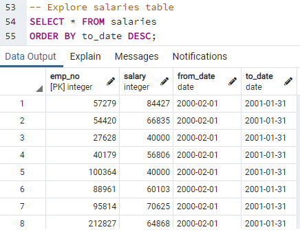
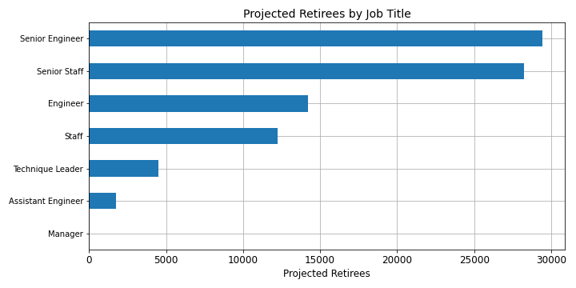
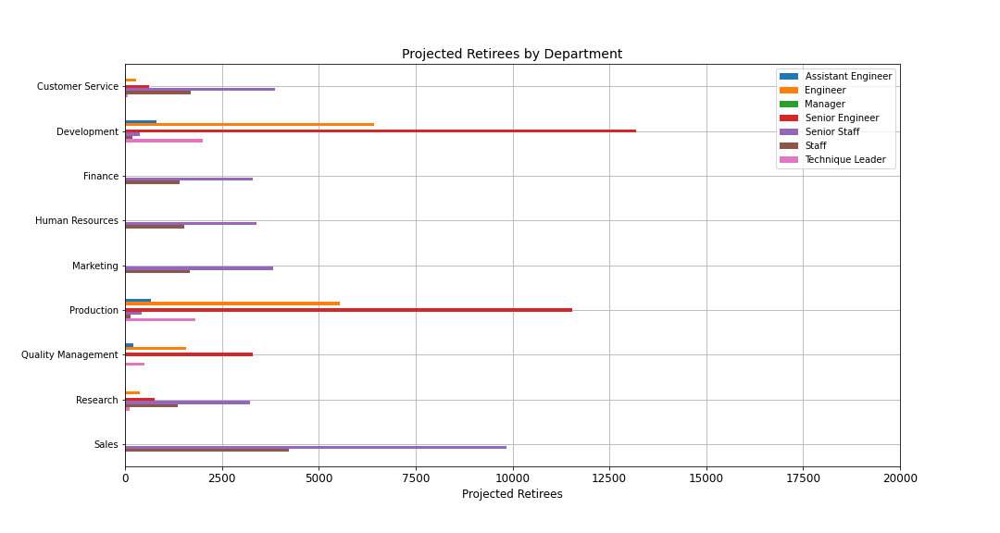

# Module 07 Challenge - Pewlett-Hackard Analysis - SQL

## Overview

In the coming years, many employees will be eligible for retirement at Pewlett-Hackard.

In order to better prepare as a company for this eventuality, Bobby and I were tasked
with compiling a set of summary data and an executive report about Pewlett-Hackard's
aging workforce.

### Deliverables:
1. The Number of Retiring Employees by Title
2. The Employees Eligible for the Mentorship Program
3. This written report

### Criteria:
As of July 18, 2021, employees currently eligible or soon to be eligible for retirement are those that: Were born between January 1, 1952 and December 31, 1955 (Ages 66-69).

Employees eligible for the Mentorship Program are those that: Were born between January 1, 1965 and December 31, 1965 (Ages 56).

### Resources

- Software:
	- PostgreSQL 11 (Input/Output, and Queries processed via pgAdmin 4)
	- Jupyter notebook server 6.3.0, running Python 3.7.10 64-bit (Dependencies: os, matplotlib, pandas, numpy)
- Data: This Analysis and Report was compiled using all Internal Company Data, Provided by Management:
	`departments.csv`
	`dept_emp.csv`
	`dept_manager.csv`
	`employees.csv`
	`salaries.csv`
	`titles.csv`

Additional information about these resources is listed below in Table 1.

**Table 1:**
| File Name             | Brief Description of Contents |
|-----------------------|-------------------------------|
| `departments.csv`     | Department numbers and names for the Nine (9) departments of Pewlett-Hackard |
| `dept_emp.csv`        | Listing of 331,603 current and former employee numbers (300,024 unique) with associated Department(s) and Date(s) of position |
| `dept_manager.csv`    | Listing of 24 current and former employee numbers of Department Managers with associated Department(s) and Date(s) of position |
| `employees.csv`       | Listing of 300,024 unique current and former employee numbers with Birth Date, First Name, Last Name, Gender, and Hire Date |
| `salaries.csv`        | Listing of 300,024 unique current and former employee numbers with Salary and Date(s) of associated pay |
| `titles.csv`          | Listing of 443,308 current and former employee numbers (300,024 unique) with associated Job Title(s) and Date(s) of position |

## Results

### Deliverables

Before moving on to commentary and analysis, we will present the deliverables requested.

1. The Number of Retiring Employees by Title is shown below in Table 2, and is also available in the project GitHub Repository under `Data/retiring_titles.csv`.

**Table 2:**
| Title | Count |
|-------|-------|
| Senior Engineer | 29,414
| Senior Staff | 28,254
| Engineer | 14,222
| Staff | 12,243
| Technique Leader | 4,502
| Assistant Engineer | 1,761
| Manager | 2

Additionally, the Current Job Titles for all 90,398 employees currently eligible for retirement can be viewed in the project GitHub Repository under `Data/unique_titles.csv`. Complete information on each employee including all of their current and former job title(s) and position date(s) is under `Data/retirement_titles.csv`

2. The Employees Eligible for the Mentorship Program. There are a total of 1,549 current employees who are eligible for the mentorship program.
In order to conserve space, the entire table will not be reproduced here, but it is available in the project GitHub Repository under `Data/mentorship_eligibility.csv`.

### Commentary on Deliverables

While exploring the data provided and the relationships between them, we noticed a few things that warrant examination.

1. Taking a look at just the Salaries Table, it would appear that either no employee has received a raise since January 31, 2001 at the latest, or the original salaries data source has become corrupted, or has not been updated, or there was some other error in data retrieval. A quick screen capture of what this looks like is shown here in Figure 1.

**Figure 1:**

2. Of the 90,398 employees eligible for retirement, 57,668--or 63.8% of the group--currently occupy Senior Roles. Without taking replacements into consideration, this leaves 149,726 employees remaining at the organization to fill these Senior roles.

3. Of the 90,398 employees eligible for retirement, 45,397--or 50.2% of the group--are Engineering Positions. This information could prove useful to the Human Resources Department and Hiring Managers by way of preparation. These positions could have additional qualifications or skills required, as well as different approaches to recruiting, interviewing, and retention as opposed to Staff positions. For a different way to visualize the situation, and for reference, the relative number of retiring employees by department is shown here in Figure 2.

4. If 1:1 Employee and Manager Replacement is desired, it should be noted that different divisions have different make-ups for their retiring workforces. The Development, Production, and Quality Management Departments have more retiring Engineers and Senior Engineers, while the remaining departments have more retiring Staff and Senior Staff. These relationships are visualized below in Figure 3.

**Figure 3:**

## Summary

1. Of the 300,024 unique employee numbers present in the dataset, 240,124 represent current employees. The 90,398 employees currently eligible for retirement represent 37.6% of the current workforce. The yearslong dedication and contribution of these employees and managers is deeply valued by our organization.

However, prior to diving headlong into a 1:1 replacement program, we should pause and consider what this change could mean for our organization. With a properly implemented Mentorship Program, combined with restructuring, improvements in operational efficiency, and training, could a smaller workforce be a blessing in disguise? Fewer desks, less office space required, a reduced payroll, slimmed down organization chart... This could result in a future where more Organization Dollars could be dedicated to Marketing, Research, and improving Customer Service, just as a start. The restructuring and modernization of IBM in the 1990s and 2000s provides a valuable instructive example here.

2. Finally, let us consider the Mentorship Program. If we understand this program correctly, as it stands we would be expecting 1,549 experienced employees to mentor a replacement cadre of 90,398 employees among the remaining pool of 149,726. Working with these assumptions, that would require each Mentor to take 96 junior employees under their wing. Even with very informal mentorship, this seems unworkable and likely ineffective.

On the other hand, if we expand the pool of eligibility for the Mentorship Program, the shape of the problem changes drastically. Just as an illustration, the pool was arbitrarily expanded to include employees born between January 1, 1960 and December 31, 1970. With current ages between 51 and 61, it is likely that many of these potential Mentors would still have sufficient experience and seniority to serve as effective mentors. In this case, there are 93,756 potential mentors available to help train and fill the needed 90,398 positions. Some of the mentors could potentially fill the positions themselves, each potential mentor could be assigned only one mentee for in-depth side-by-side training, and many senior employees who did not otherwise qualify or desire to be a mentor would not be required or needed to.
